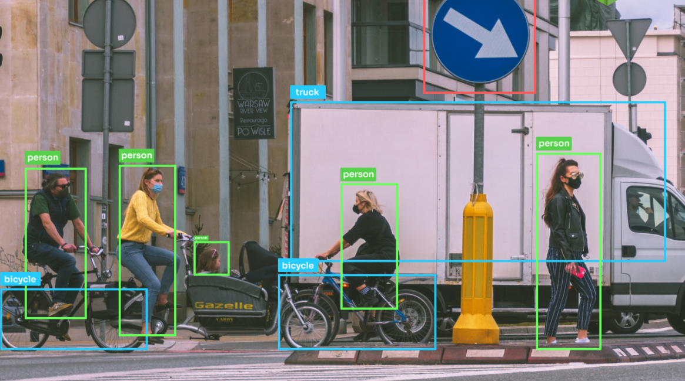

<h2 align="center">
  Object Detection App using YOLO<br/>

</h2>

<div align="center">
  
</div>

<br/>


---

## 🚀 About the Project

This is a real-time object detection application using the YOLO (You Only Look Once) model. It uses a webcam or video input to detect objects in frames using a pre-trained deep learning model.

## 👩‍💻 Built With

- Python
- OpenCV
- YOLOv3 / YOLOv5
- Jupyter Notebook / Python Script
- GitHub Pages (for static demo or project docs)

## 🎥 Features

- ✅ Real-time detection using webcam
- ✅ Object labels and confidence scores
- ✅ Easy to customize and extend
- ✅ Lightweight and fast


## 🔧 Installation & Setup

```bash
git clone https://github.com/Sa2ff/object-detection-.git
cd object-detection-
pip install -r requirements.txt
python detect.py
